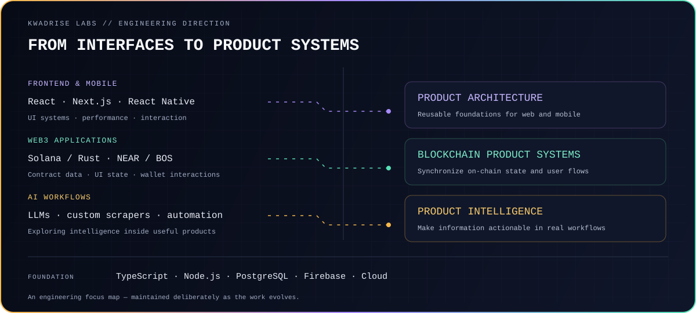
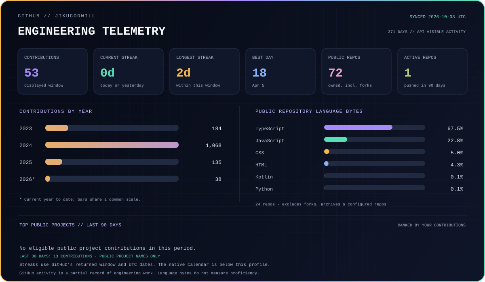

  

  <a href="https://www.linkedin.com/in/jiku-godwill">LinkedIn</a> ·
  <a href="https://twitter.com/JikuGodwill">X</a> ·
  <a href="https://kwadrise.com">KwadRise Labs</a> ·
  <a href="mailto:godwill@kwadrise.com">Email</a>

## `> system_profile`

I'm **Godwill Jiku**, a product-focused software engineer and technical founder with **5+ years of experience** building production applications.

As **Founder & CEO of KwadRise Labs**, I lead product architecture and engineering across web, mobile and blockchain applications.

- **Frontend architecture:** React, Next.js and TypeScript; reusable UI systems and performant product experiences.
- **Mobile:** React Native applications with attention to interaction design and maintainable architecture.
- **Web3:** Experience in the Solana and NEAR ecosystems, including PotLock.
- **AI:** Developing LLM-powered workflows, custom scrapers and blockchain intelligence tools.

Based in **Cameroon**, building for users and teams around the world.

## `> engineering_focus`

  

## `> working_stack`

| Area | Technologies |
| --- | --- |
| Primary languages | TypeScript, JavaScript, Python |
| Web and backend | React, Next.js, Node.js |
| Mobile | React Native, Reanimated, Zustand |
| UI systems | Tailwind CSS, Material UI, reusable components |
| Data | PostgreSQL, Firebase, MongoDB, MySQL |
| Blockchain | Solana, NEAR, smart contracts |
| AI | LLMs, OpenAI API, prompt engineering |

## `> engineering_telemetry`

  

Refreshed by GitHub Actions. Contribution totals reflect the activity GitHub makes visible to the workflow. Streaks use UTC dates and the displayed 365-day window. Language percentages describe code bytes in owned public repositories, excluding forks and archives.

## `> connect`

I'm open to **remote engineering roles** and **product collaborations** involving frontend architecture, AI or Web3.

For engineering work and KwadRise Labs enquiries: **[godwill@kwadrise.com](mailto:godwill@kwadrise.com)**.
